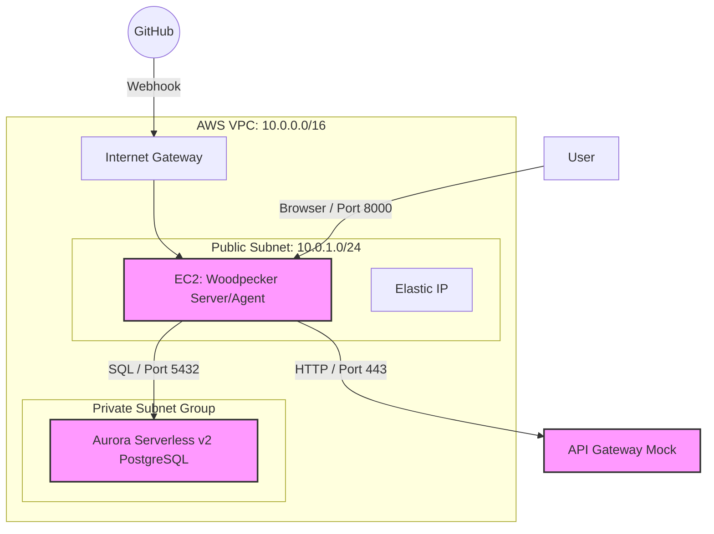

# AWS環境設計

## 1. インフラ構成図 (Mermaid)



## 2. AWSリソース詳細設計書

### A. データベース (Aurora Serverless v2)

最新のリリースノートに基づき、PostgreSQL 16系の最新マイナーバージョンを指定します。

| 設定項目 | 詳細 | 設計値 | 備考 |
|---------|------|--------|------|
| エンジンバージョン | Aurora PostgreSQL | 16.10 | 2025年11月リリースの最新安定版 |
| インスタンス設定 | Serverless v2 | - | - |
| 最小キャパシティ | - | 0.0 ACU | 非アクティブ時に自動停止する設定 |
| 最大キャパシティ | - | 1.0 ACU | 検証用のため最小限に設定 |
| 非アクティブ後の停止 | - | 5分 | 最短の設定（コスト削減のため） |
| サブネットグループ | - | Private Subnet x 2以上 | AZ跨ぎの配置が必須 |
| パブリックアクセス | - | 無効 | セキュリティのため内部通信のみ |

### B. コンピューティング (EC2)

Woodpecker CIをホストし、Venomテストを実行するメインサーバーです。

| 設定項目 | 詳細 | 設計値 | 備考 |
|---------|------|--------|------|
| インスタンスタイプ | - | t3.medium | 2 vCPU / 4GB RAM (ビルド時の安定性重視) |
| AMI | - | Amazon Linux 2023 | 最新のECS最適化または標準AMI |
| Elastic IP | - | 1つ取得・紐付け | GitHubのWebhook先を固定するため |
| IAM ロール | - | AmazonSSMManagedInstanceCore | SSHキー不要でログイン可能にする |

### C. セキュリティグループ (SG)

最小限の疎通を許可する設定です。

| SG名 | 方向 | ポート | ソース | 用途 |
|------|------|--------|--------|------|
| App-SG<br>(EC2用) | In | 8000 | 0.0.0.0/0 | Woodpecker UI (ブラウザ) |
| | Out | ALL | 0.0.0.0/0 | GitHub/API GWへのアクセス |
| DB-SG<br>(Aurora用) | In | 5432 | App-SG のID | EC2からのSQL通信のみ許可 |
| | Out | - | - | 基本不要 |

## 3. 構築・運用のポイント

### 0.0 ACU の挙動（コールドスタート）

- 0.0 ACU（停止状態）から最初の接続（VenomからのSQL実行など）があると、DBの起動に **15〜30秒** 程度かかります
- CIの最初のステップで `pg_isready` 等を使って、DBが起きるのを待つ処理を入れるとテストが安定します

### 最新バージョンの指定

- AWSコンソールで作成する際は、**16.10** またはその時点での最新（デフォルト）を選択してください
- 0.0 ACUをサポートするには **16.3 以上** である必要があります

### RDS Data API の活用（オプション）

- 今回は直接SQLを叩く構成ですが、Aurora Serverless v2 + Data APIを有効にすると、セキュリティグループの設定を簡略化してHTTPS経由でSQLを実行することも可能です

## 4. Terraform実行手順

### 初期化

```bash
cd /home/naka/claude_code/2601_venom/src/terraform
terraform init
```

### 実行

```bash
terraform apply
```

- 完了まで約 **10〜15分** かかります（Auroraの作成に時間がかかります）
- 実行中に確認プロンプトが表示されたら `yes` と入力してください

### 接続情報の確認

実行完了後、以下の出力値が表示されます：

```
woodpecker_public_ip = "xxx.xxx.xxx.xxx"
db_endpoint = "woodpecker-db-cluster.cluster-xxxxxxxxx.ap-northeast-1.rds.amazonaws.com"
```

### 次のステップ

1. **GitHub OAuthアプリケーションの設定**
   - `woodpecker_public_ip` を使用して、GitHub OAuthのコールバックURLを更新します
   - URL形式: `http://<woodpecker_public_ip>:8000/authorize`

2. **EC2への接続**
   - AWS Systems Manager Session Managerを使用してEC2に接続できます
   - または、セキュリティグループにSSH (ポート22) を追加して接続することも可能です

3. **Woodpeckerのセットアップ**
   - EC2にSSH/Session Managerで接続後、docker-composeでWoodpeckerを起動します
