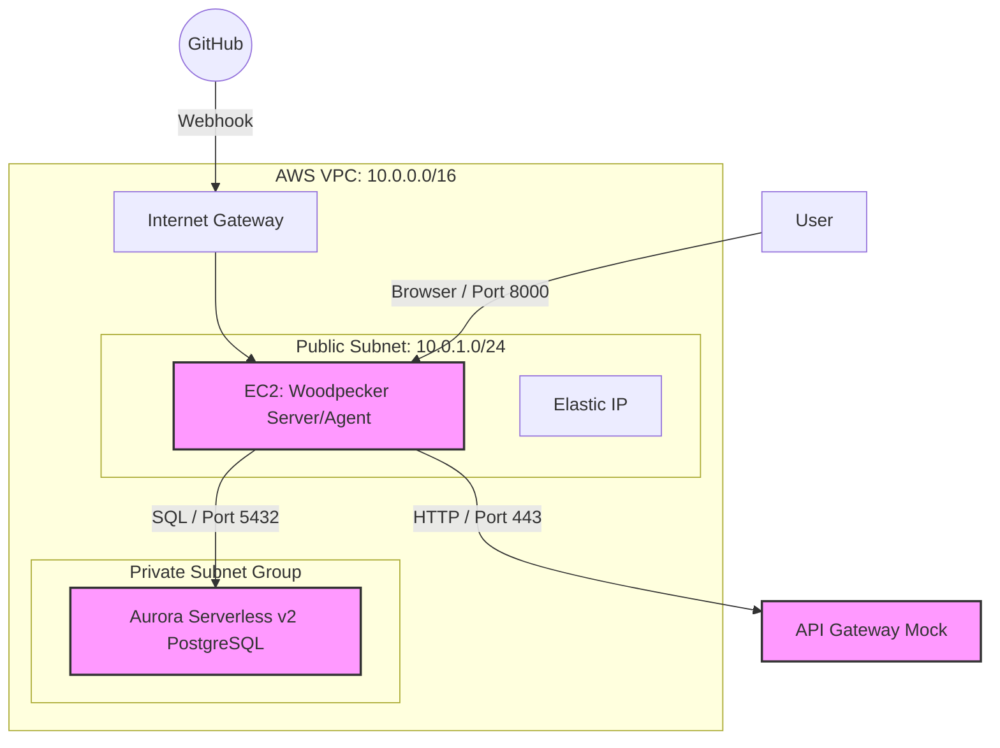

# AWS環境設計

## 1. インフラ構成図 (Mermaid)



## 2. AWSリソース詳細設計書

### A. データベース (Aurora Serverless v2)

最新のリリースノートに基づき、PostgreSQL 16系の最新マイナーバージョンを指定します。

| 設定項目 | 詳細 | 設計値 | 備考 |
|---------|------|--------|------|
| エンジンバージョン | Aurora PostgreSQL | 16.10 | 2025年11月リリースの最新安定版 |
| インスタンス設定 | Serverless v2 | - | - |
| 最小キャパシティ | - | 0.0 ACU | 非アクティブ時に自動停止する設定 |
| 最大キャパシティ | - | 1.0 ACU | 検証用のため最小限に設定 |
| 非アクティブ後の停止 | - | 5分 | 最短の設定（コスト削減のため） |
| サブネットグループ | - | Private Subnet x 2以上 | AZ跨ぎの配置が必須 |
| パブリックアクセス | - | 無効 | セキュリティのため内部通信のみ |

### B. コンピューティング (EC2)

Woodpecker CIをホストし、Venomテストを実行するメインサーバーです。

#### B-1. EC2インスタンス基本情報

| 設定項目 | 詳細 | 設計値 | 備考 |
|---------|------|--------|------|
| インスタンスタイプ | - | t3.medium | 2 vCPU / 4GB RAM (ビルド時の安定性重視) |
| AMI | - | Amazon Linux 2023 | 動的取得（最新版を自動選択） |
| アーキテクチャ | - | x86_64 | - |
| 仮想化タイプ | - | hvm | - |
| Elastic IP | - | 1つ取得・紐付け | GitHubのWebhook先を固定するため |
| IAM ロール | - | AmazonSSMManagedInstanceCore | SSHキー不要でログイン可能にする |
| ストレージ | EBS gp3 | 8GB (デフォルト) | ログやDockerイメージ用 |

#### B-2. オペレーティングシステム (OS)

| 項目 | 詳細 | 備考 |
|------|------|------|
| OS名 | Amazon Linux 2023 | - |
| カーネル | Linux 5.15+ | AL2023の標準カーネル |
| パッケージマネージャー | dnf (yum後継) | `dnf install` でパッケージ管理 |
| systemd | 有効 | サービス管理（Docker等） |
| SELinux | Enforcing (デフォルト) | セキュリティ強化モード |

#### B-3. インストール済みミドルウェア

EC2起動時（user_data）に以下がインストールされます。

**基本パッケージ**:

| パッケージ名 | バージョン | 用途 |
|------------|----------|------|
| Docker | 最新版 (26.x+) | Woodpecker/Venomのコンテナ実行環境 |
| Docker Compose | 最新版 (v2.x+) | Woodpeckerのマルチコンテナ管理 |
| Git | 最新版 (2.x+) | リポジトリクローン |

**インストールコマンド** (user_data):
```bash
#!/bin/bash
dnf update -y
dnf install -y docker git
systemctl enable --now docker

# Docker Composeインストール
curl -L "https://github.com/docker/compose/releases/latest/download/docker-compose-$(uname -s)-$(uname -m)" -o /usr/local/bin/docker-compose
chmod +x /usr/local/bin/docker-compose
```

#### B-4. Woodpecker CI構成

**Woodpecker Server** (woodpecker-server):

| 項目 | 詳細 |
|------|------|
| イメージ | woodpeckerci/woodpecker-server:latest |
| ポート | 8000 (HTTP UI) |
| 認証方式 | GitHub OAuth |
| データ永続化 | Named Volume: woodpecker-server-data |
| 環境変数 | WOODPECKER_HOST, WOODPECKER_GITHUB_CLIENT, WOODPECKER_GITHUB_SECRET 等 |

**Woodpecker Agent** (woodpecker-agent):

| 項目 | 詳細 |
|------|------|
| イメージ | woodpeckerci/woodpecker-agent:latest |
| 役割 | パイプライン実行（Docker in Docker） |
| Docker接続 | /var/run/docker.sock マウント |
| 環境変数 | WOODPECKER_SERVER, WOODPECKER_AGENT_SECRET |

#### B-5. Venom構成

Venomは**Woodpeckerパイプライン内でDockerコンテナとして実行**されます。

| 項目 | 詳細 |
|------|------|
| イメージ | ovhcom/venom:latest |
| 実行タイミング | `.woodpecker.yml` の `test` ステップ |
| テスト定義 | `tests/api_db_test.venom.yml` |
| 実行コマンド | `venom run tests/*.venom.yml --var "db_url=..." --var "api_url=..."` |
| サポート機能 | HTTP (API Gateway), DBFixtures (PostgreSQL) |

#### B-6. EC2上のディレクトリ構成

```
/home/ec2-user/
├── 2601_venom/                   # GitHubからクローンしたリポジトリ
│   ├── src/
│   │   ├── docker-compose.yml    # Woodpecker起動設定
│   │   ├── .woodpecker.yml       # パイプライン定義
│   │   ├── sql/                  # DBスキーマ・シードデータ
│   │   │   ├── 01_schema.sql
│   │   │   └── 02_seed.sql
│   │   ├── tests/                # Venomテスト定義
│   │   │   └── api_db_test.venom.yml
│   │   ├── setup.sh              # 初回セットアップスクリプト
│   │   ├── secrets.txt           # GitHub Personal Access Token (gitignore済)
│   │   └── README.md
│   ├── 01_Document/
│   └── 03_Research/

/var/lib/docker/
└── volumes/
    └── woodpecker-server-data/   # Woodpecker永続データ
        ├── woodpecker.db          # SQLiteデータベース
        └── ...
```

#### B-7. ポート情報

| ポート | プロトコル | 用途 | 公開範囲 |
|--------|----------|------|---------|
| 22 | TCP | SSH (EC2 Instance Connect) | 0.0.0.0/0 (テスト用) |
| 8000 | TCP | Woodpecker UI | 0.0.0.0/0 (ブラウザアクセス用) |
| 443 | TCP (Out) | GitHub API / API Gateway | Egress All |
| 5432 | TCP (Out) | Aurora PostgreSQL | Egress All |

**セキュリティ上の注意**:
- 本番環境では、ポート22とポート8000のソースを特定のIPアドレスに制限してください
- 現在の設定（0.0.0.0/0）は検証用の簡易設定です

#### B-8. リソース使用率の目安

**CPU**:
- アイドル時: 5-10%
- パイプライン実行中: 30-60%
- ピーク時: 80% (複数コンテナ起動時)

**メモリ**:
- Woodpecker Server/Agent: 約200-300MB
- Venom実行時: 約50-100MB
- PostgreSQLクライアント: 約20-50MB
- 合計: 約500MB-1GB (4GBのうち)

**ディスク**:
- OS: 約2GB
- Docker イメージ: 約2-3GB
- ログ・キャッシュ: 約500MB-1GB
- 空き容量: 約2-3GB

### C. セキュリティグループ (SG)

最小限の疎通を許可する設定です。

| SG名 | 方向 | ポート | ソース | 用途 |
|------|------|--------|--------|------|
| App-SG<br>(EC2用) | In | 8000 | 0.0.0.0/0 | Woodpecker UI (ブラウザ) |
| | Out | ALL | 0.0.0.0/0 | GitHub/API GWへのアクセス |
| DB-SG<br>(Aurora用) | In | 5432 | App-SG のID | EC2からのSQL通信のみ許可 |
| | Out | - | - | 基本不要 |

## 3. 構築・運用のポイント

### 0.0 ACU の挙動（コールドスタート）

- 0.0 ACU（停止状態）から最初の接続（VenomからのSQL実行など）があると、DBの起動に **15〜30秒** 程度かかります
- CIの最初のステップで `pg_isready` 等を使って、DBが起きるのを待つ処理を入れるとテストが安定します

### 最新バージョンの指定

- AWSコンソールで作成する際は、**16.10** またはその時点での最新（デフォルト）を選択してください
- 0.0 ACUをサポートするには **16.3 以上** である必要があります

### RDS Data API の活用（オプション）

- 今回は直接SQLを叩く構成ですが、Aurora Serverless v2 + Data APIを有効にすると、セキュリティグループの設定を簡略化してHTTPS経由でSQLを実行することも可能です

## 4. Terraform実行手順

### 初期化

```bash
cd /home/naka/claude_code/2601_venom/src/terraform
terraform init
```

### 実行

```bash
terraform apply
```

- 完了まで約 **10〜15分** かかります（Auroraの作成に時間がかかります）
- 実行中に確認プロンプトが表示されたら `yes` と入力してください

### 接続情報の確認

実行完了後、以下の出力値が表示されます：

```
woodpecker_public_ip = "xxx.xxx.xxx.xxx"
db_endpoint = "woodpecker-db-cluster.cluster-xxxxxxxxx.ap-northeast-1.rds.amazonaws.com"
```

### 次のステップ

1. **GitHub OAuthアプリケーションの設定**
   - `woodpecker_public_ip` を使用して、GitHub OAuthのコールバックURLを更新します
   - URL形式: `http://<woodpecker_public_ip>:8000/authorize`

2. **EC2への接続**
   - AWS Systems Manager Session Managerを使用してEC2に接続できます
   - または、セキュリティグループにSSH (ポート22) を追加して接続することも可能です

3. **Woodpeckerのセットアップ**
   - EC2にSSH/Session Managerで接続後、docker-composeでWoodpeckerを起動します
